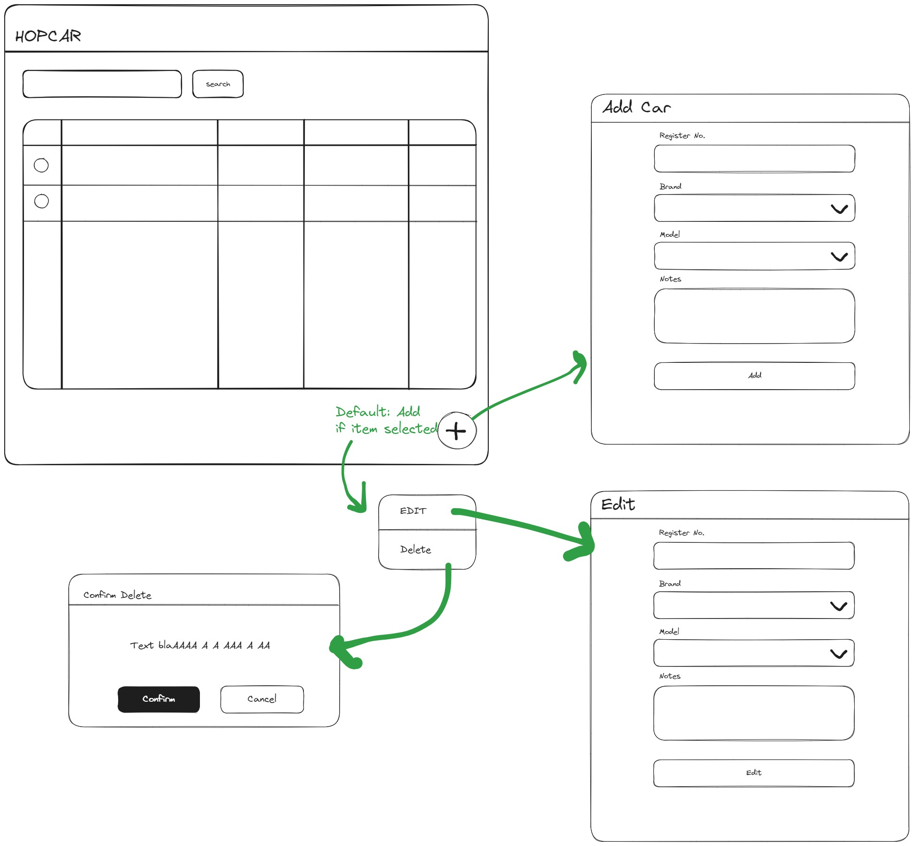

# HOPCAR

## Requirements

**Functional requirement:**

- สามารถดูข้อมูลรถยนต์ทั้งหมดที่ถูกบันทึกเข้าไปในระบบได้
- สามารถแก้ไขข้อมูลรถยนต์ที่ถูกเพิ่มเข้าไปได้
- สามารถลบข้อมูลรถยนต์ที่ถูกเพิ่มเข้าไปได้

**Technical requirement:**

- สร้าง Web frontend ด้วย React.js
- สร้าง Restful API ด้วย NodeJS สามารถใช้framework ตามถนัด
- สร้าง CRUD API และ Database สําหรับจัดเก็บข้อมูล และให้บริการ Frontend
- สามารถออกแบบ Design หน้าเว็บ รวมถึงกําหนดจํานวนหน้าได้ตามต้องการ ให้สอดคล้องกับ Functional requirement ข้างต้น
- สามารถใช้Template framework ที่แจกฟรไีด้เช่น Ant Design, Twitter’s Bootstrap เป็นต้น
- ใช้ระบบ Software Version Control ด้วย Git ในการบันทึกการพัฒนาเว็บ ตั้งแต่เริ่มสร้างโปรเจค
- Upload โค้ดที่ถูกบันทึกด้วย Git ขึ้น Repository (เช่น github, gitlab เป็นต้น) และเปิดการเข้าถึงแบบ public
- สามารถ search หาวิธีจาก Internet ได้แต่ไมอ่ นุญาตให้ใช้วิธิcopy หรือ clone โค้ดของผู้อื่นมาใช้ทั้งหมด รวมถึงการใช้Generative AI เช่น ChatGPT

## Models

**Car**
| Field | Type | desc
|--|--|--|
| id| int|pk
| registerNo | text|ทะเบียนรถยนต์
| brand| text |ยี่ห้อรถ
| model| text |รุ่นรถ
| notes| text |หมายเหตุ

## Stacks

- [React](https://react.dev/)
- Ant Design
- [Kao](https://koajs.com/)
- [Postgres](https://www.postgresql.org/)

## Wireframe

## Ref

[CAR LIST API](https://carapi.app/)
